# Naval Warfare

## Project info

The purpose of this project is to practice Test Driven Development (TDD) and tie together the concepts learned in the JavaScript module of The Odin Project. Project description can be found [here](https://www.theodinproject.com/lessons/javascript-battleship).

## Live demo

Available [here](https://jcampbell57.github.io/naval-warfare/)

## Features

- Singleplayer mode
- Multiplayer mode
- Manual ship placement
- Icons from [SVG Repo](https://www.svgrepo.com/)

## Technologies utilized

- Jest
- Babel
- Webpack
- ESLint
- Prettier

## Screenshots

### Start menu
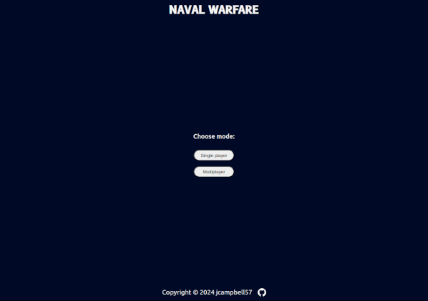
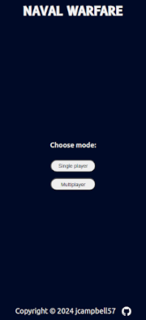

### Name input
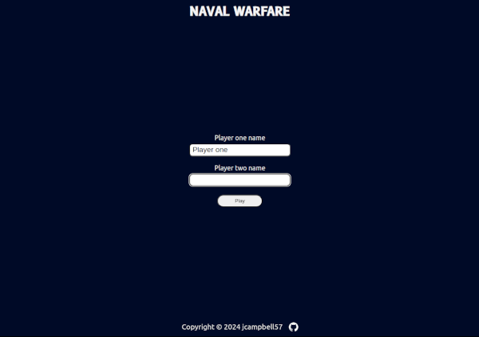
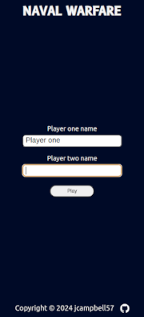

### Ship placement
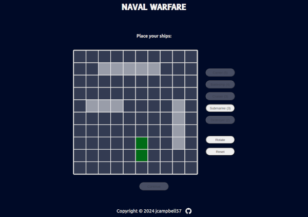
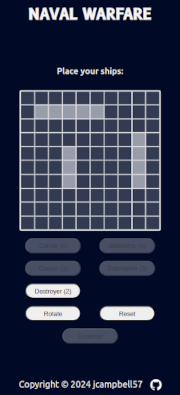

### Gameplay
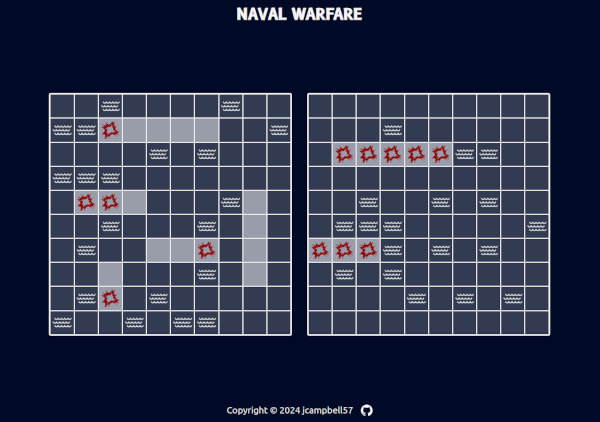
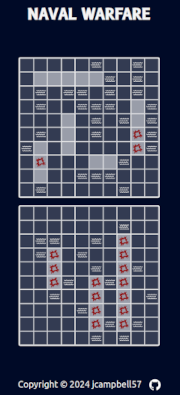

### Multiplayer privacy screen
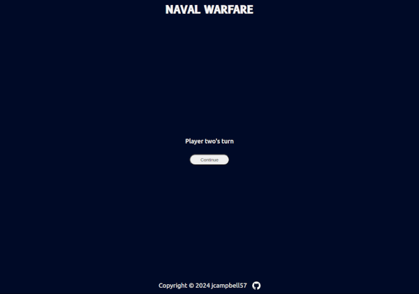

### Winner declaration
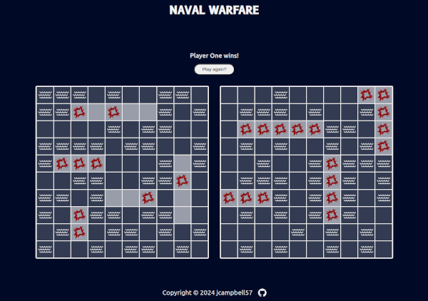
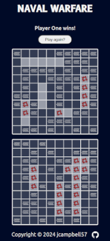

## Behind the scenes

### Improvements

This project could be improved with:

- Single player difficulty modes
- Ship icons to indicate ship placement instead of tile background color
- Animations or transitions for hit & miss attacks

### Notes

- ESLint and prettier config did not seem to be working together. After much time trying to debug, restarting VSCode seemed to resolve the issue.

- I have included [a custom font](https://fonts.google.com/specimen/B612?preview.text=NAVAL%20WARFARE), but it does not appear to be rendering properly.

### Resources

- [Jest docs](https://jestjs.io/docs/getting-started)

- [This resource](https://www.youtube.com/watch?v=pdx2HjFRaJY&list=PL0zVEGEvSaeF_zoW9o66wa_UCNE3a7BEr&index=4) was helpful for setting up jest and configuring `npm run watch`

- [This resource](https://stackoverflow.com/questions/70269056/what-is-the-cause-of-npm-warn-ebadengine) was helpful when running into node version errors while setting up jest.

- [Webpack docs - Getting started](https://webpack.js.org/guides/getting-started/)

- [Webpack docs - Asset management](https://webpack.js.org/guides/asset-management)

- [Webpack docs - HtmlWebpackPlugin](https://webpack.js.org/guides/output-management/#setting-up-htmlwebpackplugin)

- [This resource](https://stackoverflow.com/questions/49274713/get-current-mode-in-webpack-config-js) was helpful for setting up webpack for both development as well as production.

- [This resource](https://stackoverflow.com/questions/60654549/node-keeps-reverting-back-to-older-version) was helpful when my node version kept resetting.

- [Jest Webpack Guide](https://jestjs.io/docs/webpack)

- [ESLint docs - Getting started](https://eslint.org/docs/latest/use/getting-started)

- While setting up ESLint and Prettier with VSCode, I referenced [this resource](https://www.digitalocean.com/community/tutorials/linting-and-formatting-with-eslint-in-vs-code) in addition to the docs.

- [Prettier vscode docs](https://github.com/prettier/prettier-vscode)

- [Prettier docs](https://prettier.io/docs/en/install.html)

- [ESLint-config-prettier](https://github.com/prettier/eslint-config-prettier)

- The top answer of [this thread](https://stackoverflow.com/questions/49789177/module-is-not-defined-and-process-is-not-defined-in-eslint-in-visual-studio-code) seemed to resolve some ESLint errors that I was getting.

- [This resource](https://gist.github.com/cobyism/4730490) is helpful when deploying to GitHub Pages.

- [This discussion](https://www.reddit.com/r/javascript/comments/yr34u8/askjs_is_there_any_reason_to_use_a_class_over_a/) seemed informativve when choosing between class and factory.

- [This codepen](https://codepen.io/sosuke/pen/Pjoqqp) is very useful for assigning colors to SVG icons.

### Terminal commmands used during development

- Jest setup

  - `sudo apt install npm`
  - `nvm install 18.18.0`
  - `nvm use 18.18.0`
  - `nvm alias default v18.18.0`
  - `npm init`, but maybe should have used `npm init jest@latest`
  - `npm install --save-dev jest`
  - `npm install --save-dev babel-jest @babel/core @babel/preset-env`
  - `npm install --save-dev @babel/preset-env`
  - `npm test` or `npm run watch:jest` to run tests

- Webpack setup

  - `npm install webpack webpack-cli --save-dev`
  - `npm install --save lodash`
  - `npm install --save-dev style-loader css-loader`
  - `npm install --save-dev html-webpack-plugin`
  - `npm install --save-dev webpack-dev-server`
  - `npx webpack` or `npm run build:dev` to bundle in development mode
  - `npm run build:prod` to bundle in production mode
  - `npm run watch:webpack` to recompile on save
  - `npm run start:webpack` to recompile on save and refresh page
    - source-maps may not be configured correctly when using this option

- ESLint & Prettier setup

  - I don't think there is a difference between these:
    - `npm init @eslint/config@latest` ([ESLint docs](<(https://eslint.org/docs/latest/use/getting-started)>))
    - `npm install eslint --save-dev` & `./node_modules/.bin/eslint --init` ([Digital Ocean Article](https://www.digitalocean.com/community/tutorials/linting-and-formatting-with-eslint-in-vs-code))
  - `npm install --save-dev eslint-config-prettier`
  - `npm install prettier -D --save-exact`
  - `node --eval "fs.writeFileSync('.prettierrc','{}\n')"^C`

- Deployment
  - `npm run deploy`
